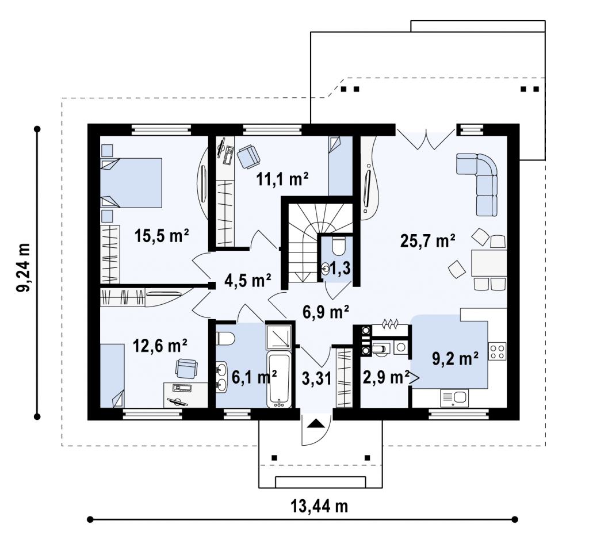
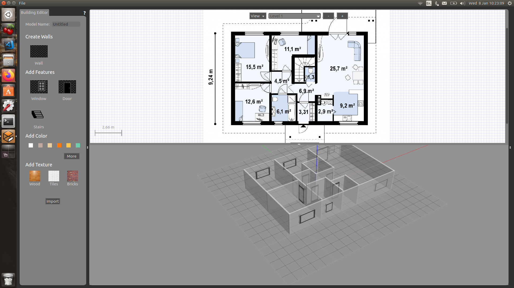
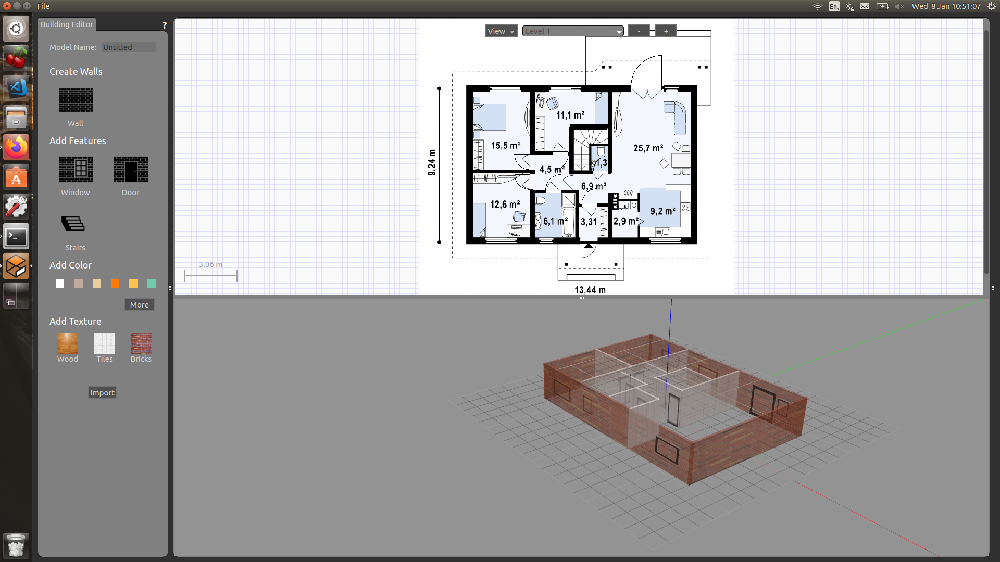
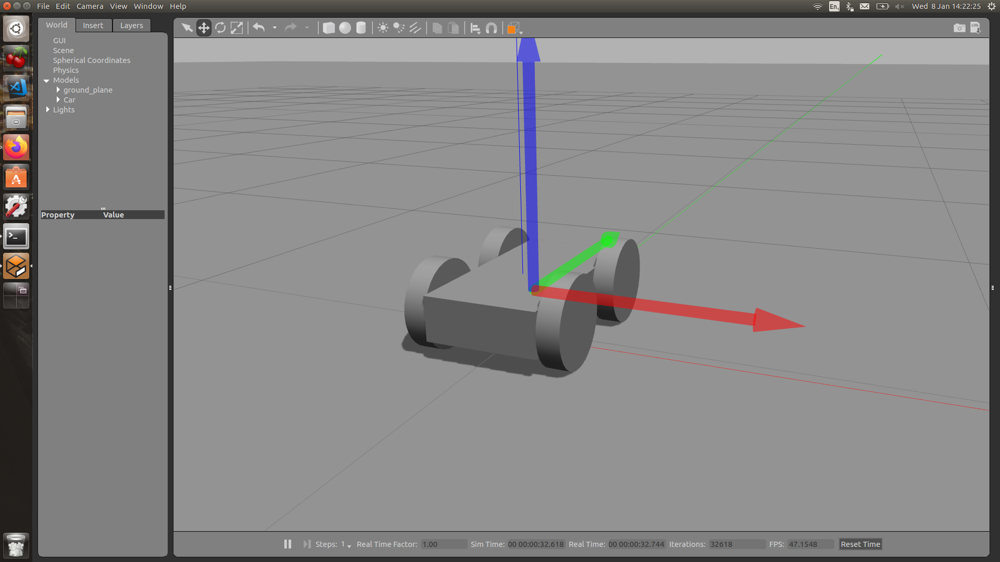
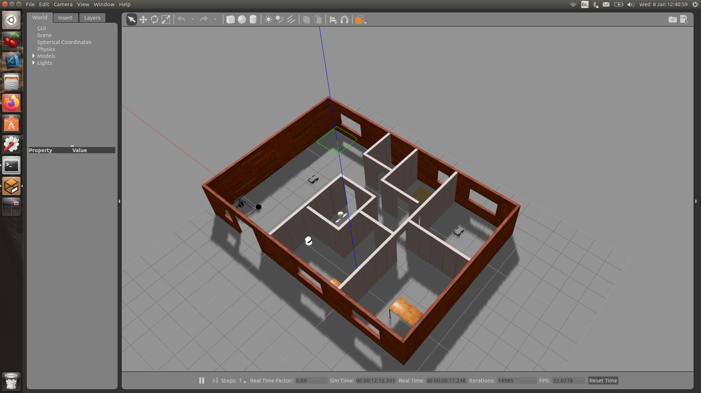
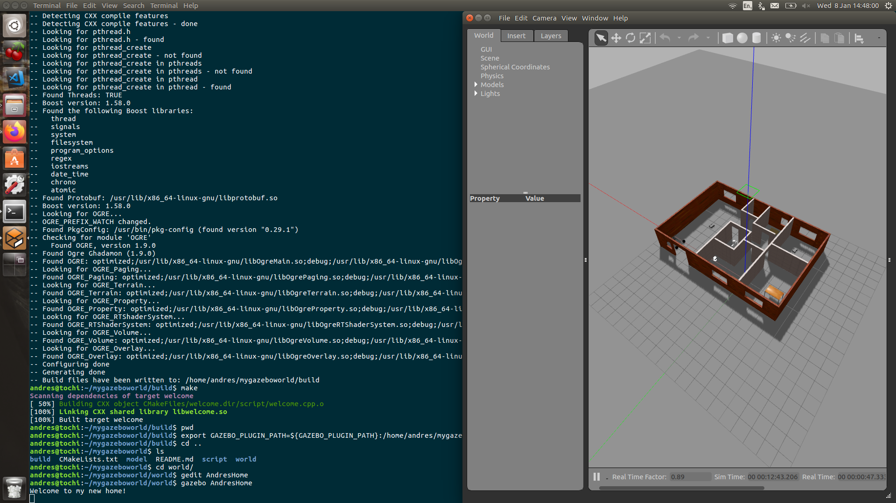

# My_Gazebo_World
## Development of a World in Gazebo from scratch
## Andres Ricardo Garcia Escalante

## Setting up the enviroment:
For this project used the following programs:
- Ubuntu 16.04 LTS OS
- Gazebo 7.9
- C++

## Models
### Home Structure
The home structure from the project was built with the following home plan found on internet:  


The project tried to mimics all the details from the original plan just taking into account the main structure as shown in the following image: 


The final Design of the home structure has the following features:
-  Material applied.
-  Doors of different sizes.
-  Windows of different sizes.
-  Different colors for outdoor and indoor walls.

The final home looks as follows:


### Car
A simple design of a car was done using the model editor of Gazebo using Geometric forms such as cilinders and cubes. The result looks as follows:


## World
In this section the two previous models were added to the world and also more than 5 models from the Gazebo library. The result looks as follows:


## Plugins
A simple plugin was added to the Gazebo world, it consists of a message displayed "Wellcome to my new Home" on the terminal when the gazebo world is executed and it looks as follows:



## Correct Execution of the Project
Besides the software requirements the project there must be a build folder in the project named "build" and then execute the following linux commands
```
$ cmake ../
$ make # You might get errors if your system is not up to date!
$ export GAZEBO_PLUGIN_PATH=${GAZEBO_PLUGIN_PATH}:/home/workspace/myrobot/build #build folder path IN MY CASE
```
